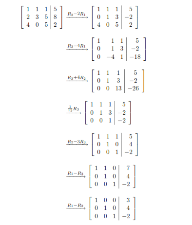
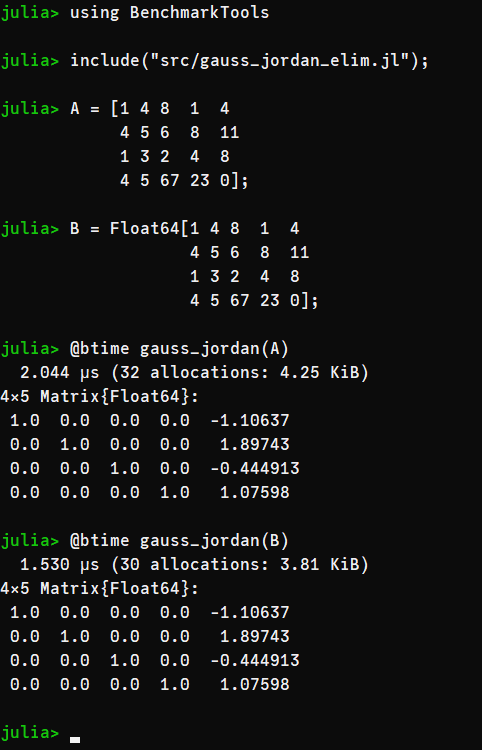

## Gauss-Jordan Elimination
This repo implements **from scratch** the **Gaussian Elimination** algorithm in [Julia Lang](julialang.org/).

If you need to refresh your memory about the technique, I suggest you read the [wikipedia page](https://en.wikipedia.org/wiki/Gaussian_elimination) of the method, which has a great introduction and applications in Linear Algebra disciplines.

## Example of the operation
 


## Function implemented
```julia
function gauss_jordan(A::Matrix{T}) where {T<:Number}
    
    # convert to float to avoid InexactError: Int64()
    (T <: Integer) && (A = convert.(Float64, A))

    # check if matrix is singular
    m, n = size(A)
    if m == n
        @assert det(A) ≠ 0.0 "Must insert a non-singular matrix"
    else
        @assert det(A[:,1:end-1]) ≠ 0.0 "Must insert a non-singular matrix or a system matrix [A b]"
    end

    for i ∈ axes(A, 1)
        if A[i,i] == 0.0                            # check if need swap rows
            swap_rows(i, m)
        end

        @. A[i,:] = A[i,:] / A[i,i]                 # divide pivot line by pivot element

        for j ∈ axes(A, 1)                          # iterate each line for each pivot column, except pivot line
            if j ≠ i                                # jump pivot line
                @. A[j,:] = A[j,:] - A[i,:]*A[j,i]  # apply gauss jordan in each line
            end
        end
    end

    return A
end

function swap_rows(i::T, nlinha::T) where {T<:Integer}
    for n ∈ (i+1):nlinha        # iterate over lines above to check if could be swap
        if A[n,i] ≠ 0.0         # condition to swap row
            L = copy(A[i,:])    # copy line to swap
            A[i,:] = A[n,:]     # swap occur
            A[n,:] = L
            break
        end
    end
end
``` 

## Benchmark inputing Int vs Float
 
